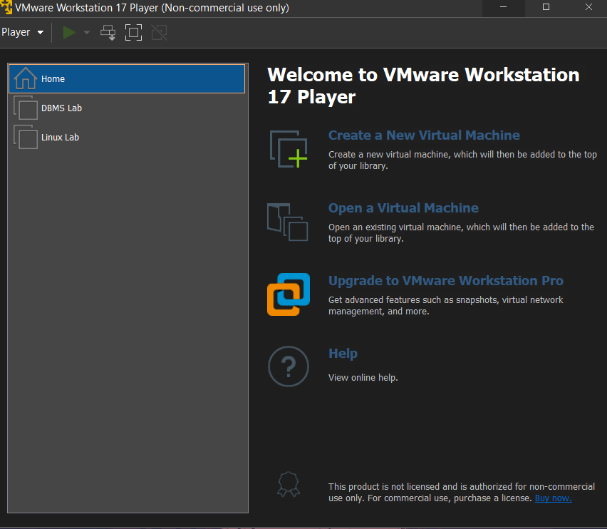
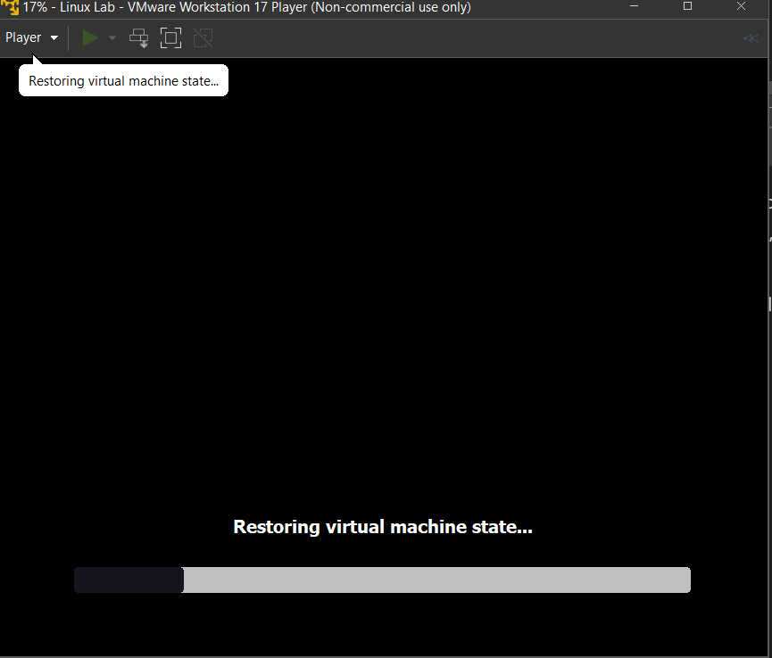
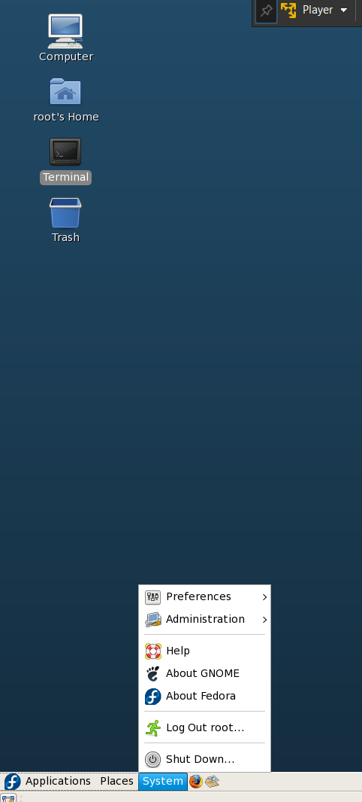
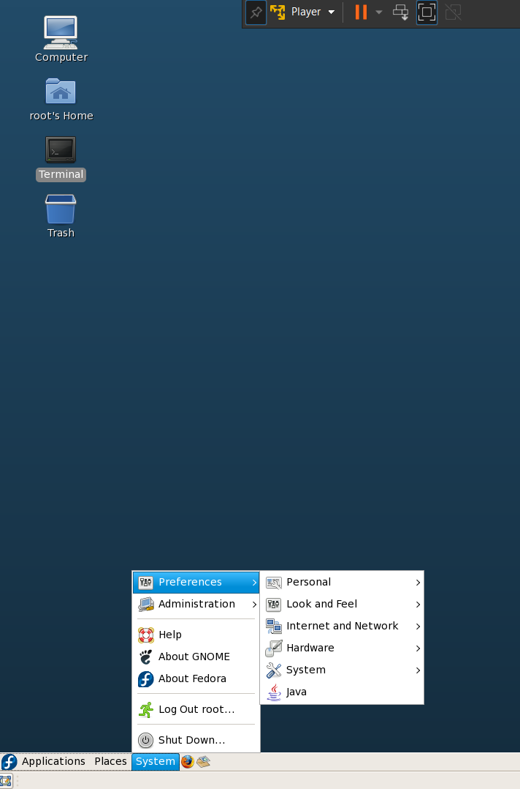
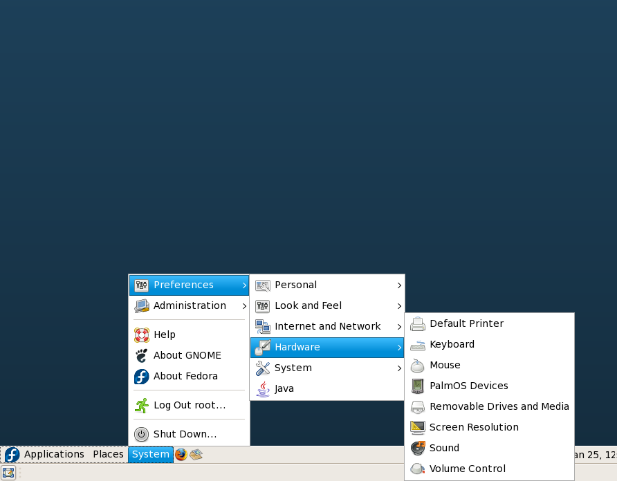
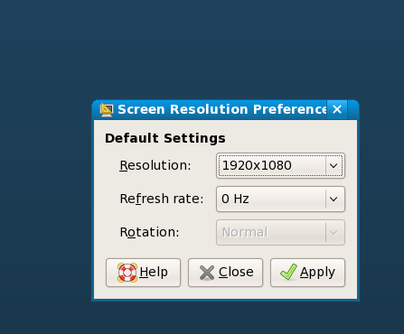

# Welcome to Directory : UNIX

## This directory contains bash scripts based on file manipulations and other things.

### How to execute the programs?

1. Download the `Linux Lab.rar` file which has been sent to your mail by college.

2. Extract the `.rar` file and you will find folder named Linux, open it.

3. Into the linux folder you will find another folder named `linux`, Copy that folder where ever you want.

4. To extract the `.rar` file on windows you can use [winrar](https://www.win-rar.com/start.html?&L=0) or [7zip](https://www.7-zip.org/).

5. After extraction download VMWare player from [here](https://download3.vmware.com/software/WKST-PLAYER-1700/VMware-player-full-17.0.0-20800274.exe).

6. Install the VMWare player.

7. While installing it may ask you to check some prompts like "Check regularly for updates","Enroll in customer information programme", uncheck those and keep clicking next.

8. It will prompt you to restart device some time while installation, please do restart.

9. After installation open the VMWare player. 

10. Click on "Open a virtual machine" and select the `linux` folder which you copied in step 3.

11. After selecting the folder it will ask you to select the `.vmx` file, select the `Clone of Red Hat Enterprise Linux 5.vmx` file and click on open.

12. It will take some time to load the VM, after loading it will ask you to enter the username and password, enter the username as `root` and password as `root123`.

13. If it dosent ask for credentials and asks you to select "moved it","copy it","cancel", select "copy it".

14. You will have something like this below.

15. Wait for sometime, you will be logged in.

Bonus Tip. To change resolution to your displays native, in Fedora click on system  

and select preferences  

and then select hardware  

and then select Screen Resolution  

and select your native resolution & click apply.

Thats it folks.